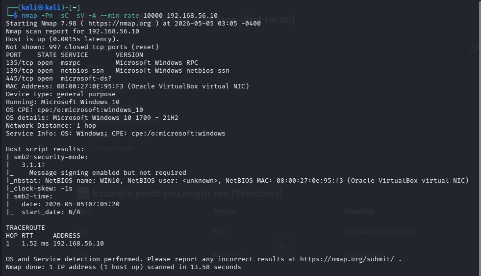
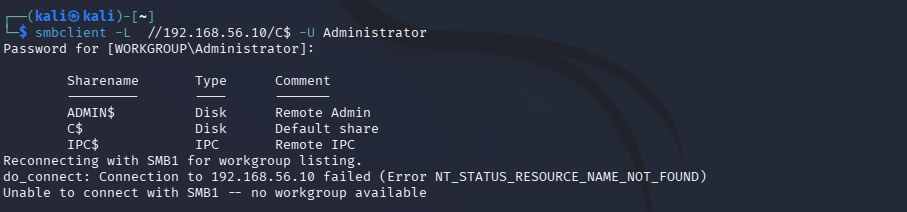
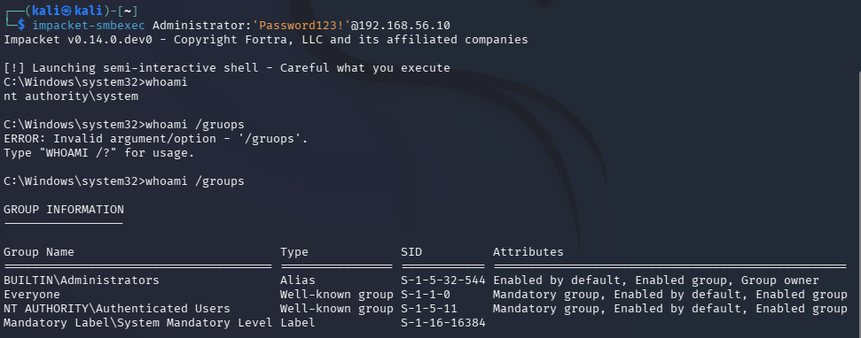
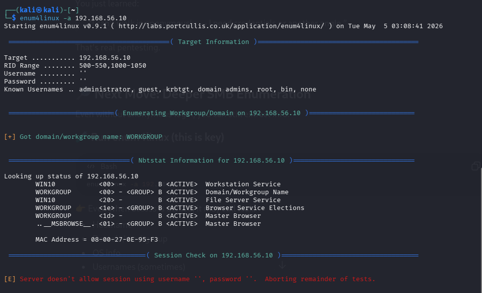
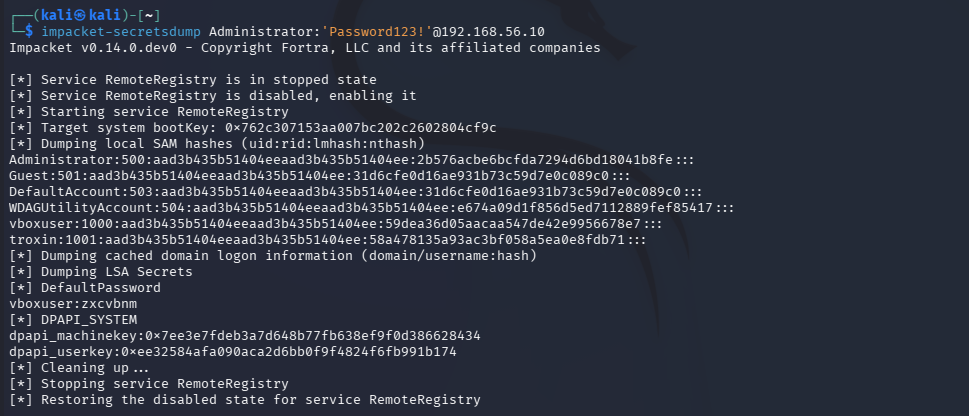
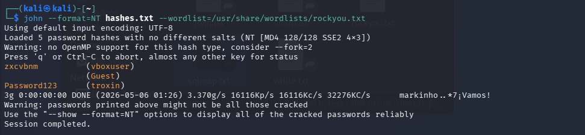

# 🖥️ Windows 10 Exploitation & Privilege Escalation Lab

## 🎯 Objective

Simulate a real-world Windows 10 compromise by performing enumeration, SMB exploitation, remote command execution, credential dumping, and privilege escalation in a controlled lab environment.

---

# 🔗 Attack Flow

- Network Enumeration (Nmap)
- SMB Enumeration
- SMB Authentication
- Remote Command Execution (SMBExec)
- Credential Dumping (SecretsDump)
- Hash Cracking (John the Ripper)
- SYSTEM-Level Access Achieved

---

# 🎯 Key Achievements

- Enumerated Windows 10 services and SMB shares
- Identified accessible SMB services on target machine
- Achieved remote shell access using Impacket SMBExec
- Dumped SAM and LSA credentials using SecretsDump
- Cracked NTLM password hashes using John the Ripper
- Obtained NT AUTHORITY\SYSTEM privileges

---

# 📌 Overview

This project demonstrates a complete Windows 10 exploitation workflow inside a self-hosted penetration testing lab. The attack chain simulates post-compromise activities including service enumeration, SMB interaction, remote execution, credential extraction, and privilege escalation techniques commonly used during internal penetration tests.

---

# 🏗️ Lab Environment

- Kali Linux (Attacker Machine)
- Windows 10 Target Machine
- VirtualBox Internal Network
- Isolated Testing Environment

---

# 🛠️ Tools Used

- Nmap
- SMBClient
- Enum4Linux
- Impacket SMBExec
- Impacket SecretsDump
- John the Ripper
- Kali Linux

---

# 📸 Screenshots

## 🔎 Nmap Enumeration

Identified SMB, RPC, and Microsoft Windows services running on the Windows 10 target.

---

## 📂 SMB Enumeration

Enumerated SMB shares and verified accessible network resources.

---

## 🧭 Remote Shell via SMBExec

Achieved remote command execution and obtained NT AUTHORITY\SYSTEM shell access.

---

## 🔍 Enum4Linux Enumeration

Performed SMB and workgroup enumeration against the target machine.

---

## 🔐 Credential Dumping

Dumped SAM and LSA credential hashes using SecretsDump.

---

## 🔓 Password Hash Cracking

Cracked NTLM hashes using John the Ripper and recovered weak passwords.

---

# ✅ Result

✔ Windows 10 machine successfully compromised  
✔ SYSTEM-level shell access obtained  
✔ Password hashes extracted and cracked  
✔ Full exploitation workflow demonstrated  

---

# 🧠 Skills Demonstrated

- Windows Enumeration
- SMB Enumeration
- Remote Command Execution
- Credential Dumping
- NTLM Hash Cracking
- Windows Privilege Escalation
- Post-Exploitation Techniques

---

# ⚠️ Disclaimer

This project was conducted in a self-hosted lab environment created for educational and ethical penetration testing purposes only.
